# TOC Project 2020

## Finite State Machine

## Method
*  I have used python's webscraping method(BeautifulSoup) to webscrape all of my data for this project
*  there are several websites that i have used and their links will be down below in the reference section

## Features

### Initial interface
There will be 4 templates including Laptop,CPU,New to buying your own laptop?,Shopping for Laptop

    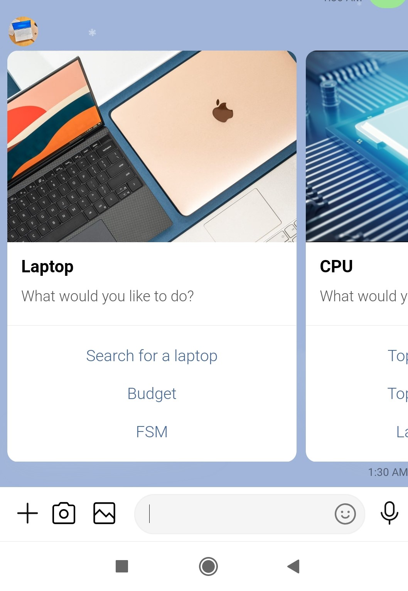

    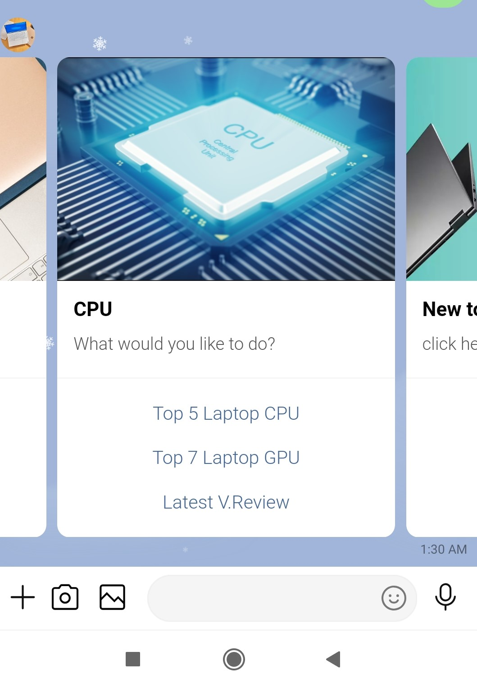

    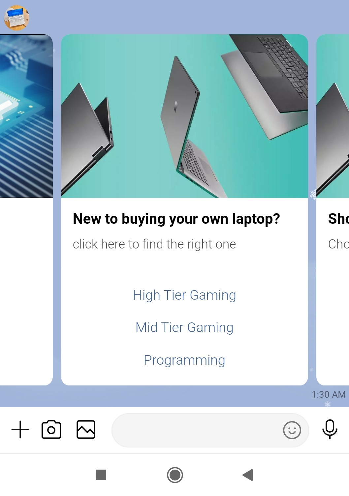

## Laptop 

#### Search for a specific laptop 
just key in any laptop in the market currently
it will show its specs and pros and cons

    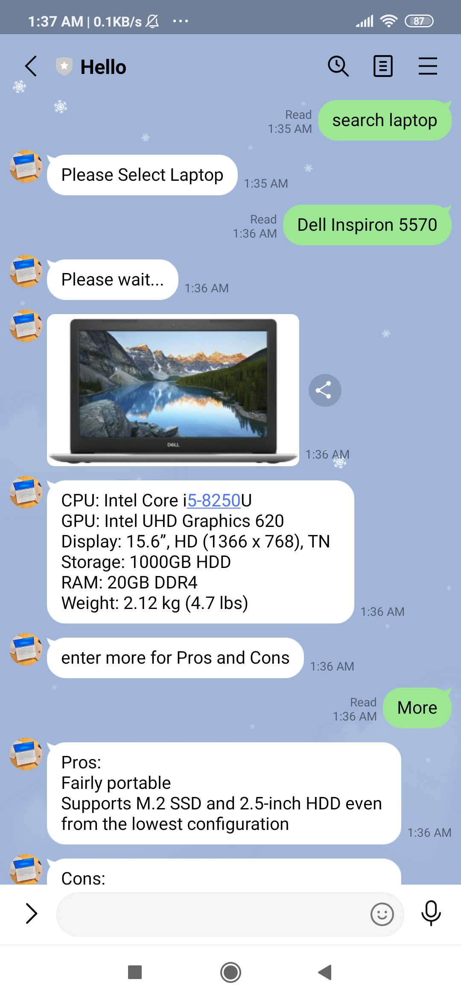

    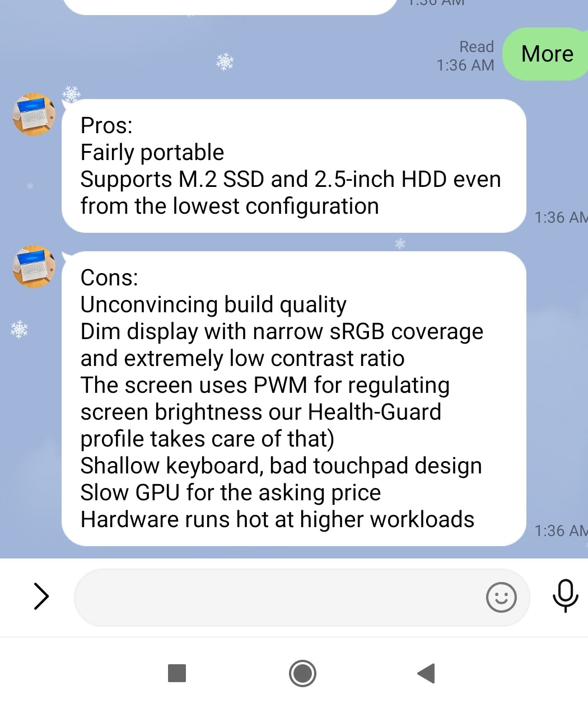

#### Budget
There will be 3 different budget friendly prices to choose from
< $700USD
< $500USD
< $300USD

    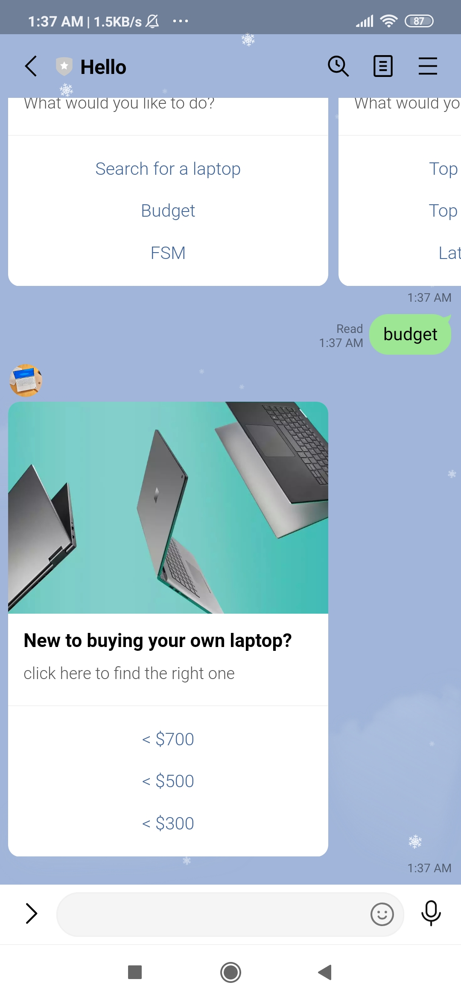

    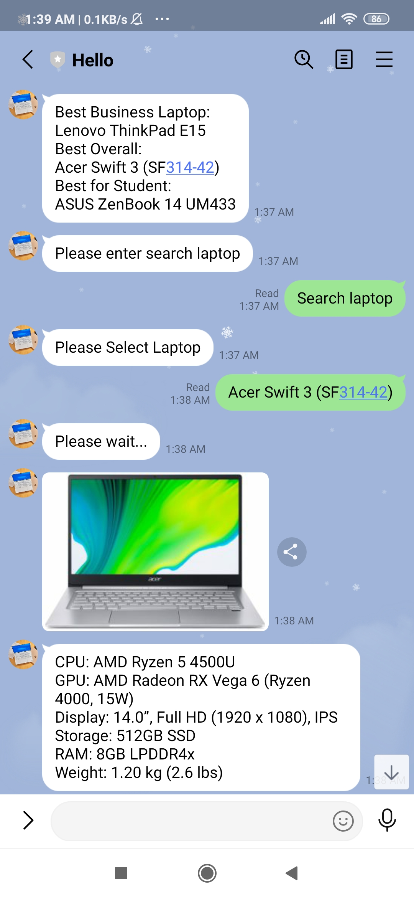

#### FSM
Just allow user to see the fsm for my linechatbot

### CPU/GPU
There will be 3 different options
1) Top 5 CPU chips in laptops
2) Top 7 GPU chips in laptops
3) Latest Video Review on CPU and GPU in Youtube

    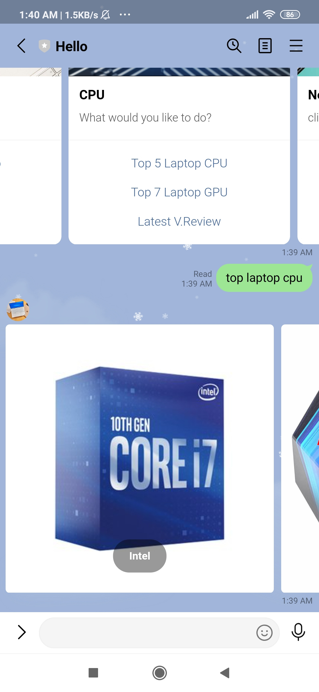

    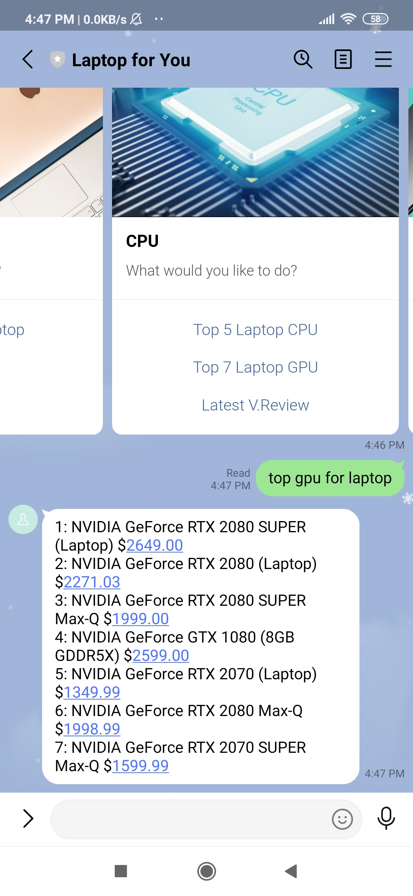

    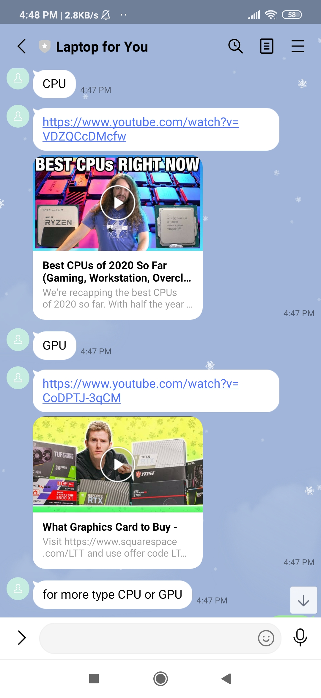

### First timer
Instead of choosing your own laptop
click on some selections made by top reviwers
* high-end gaming
* mid-end gaming
* good for programming
each of them will show 5 different laptops ranging from asus,apple,dell and many other more
it will list down their specs 

    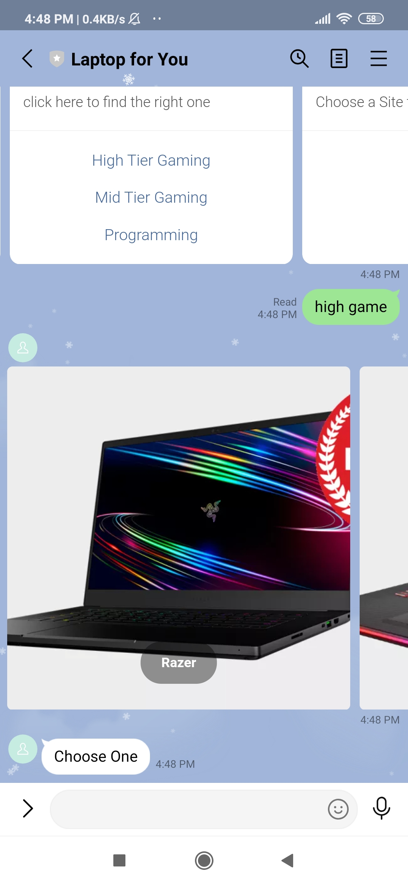

    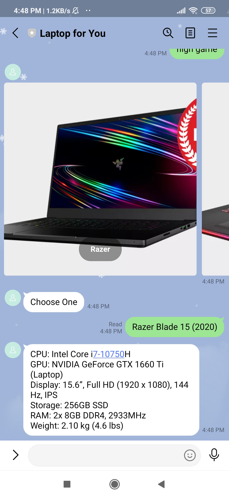

### Shopping
Showcase some of the wellknown websites to purchase laptops or electronical devices

    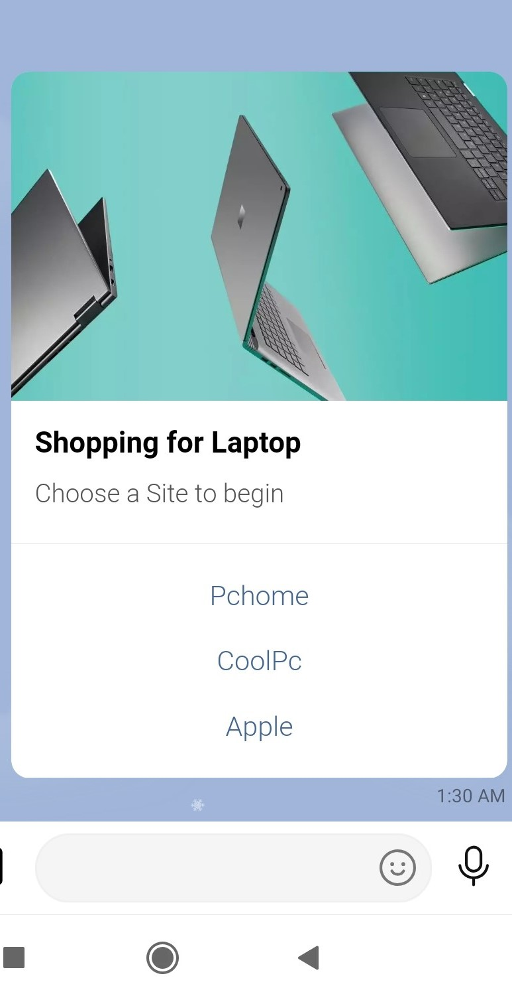

## Reference
[Pipenv](https://medium.com/@chihsuan/pipenv-更簡單-更快速的-python-套件管理工具-135a47e504f4) ❤️ [@chihsuan](https://github.com/chihsuan)

[TOC-Project-2019](https://github.com/winonecheng/TOC-Project-2019) ❤️ [@winonecheng](https://github.com/winonecheng)

Flask Architecture ❤️ [@Sirius207](https://github.com/Sirius207)

[Line line-bot-sdk-python](https://github.com/line/line-bot-sdk-python/tree/master/examples/flask-echo)

[Laptopmedia](https://laptopmedia.com/)

[Top10LaptopUnder700](https://laptopunderbudget.com/best-laptops-under-700-dollars/)

[Top10LaptopUnder500](https://laptopunderbudget.com/best-laptops-under-500-dollars/)
